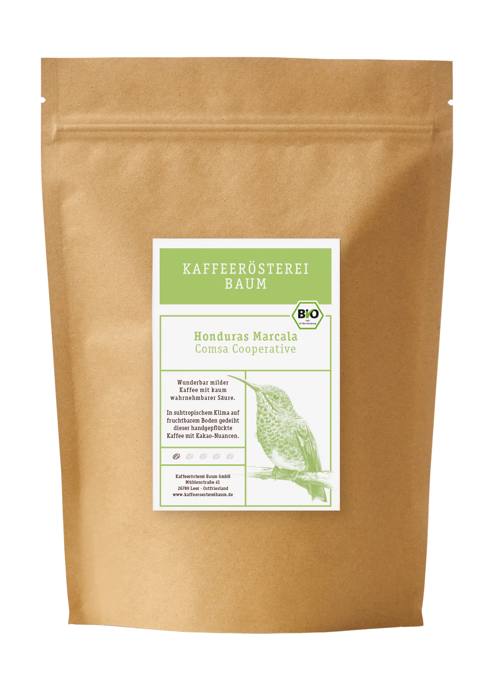
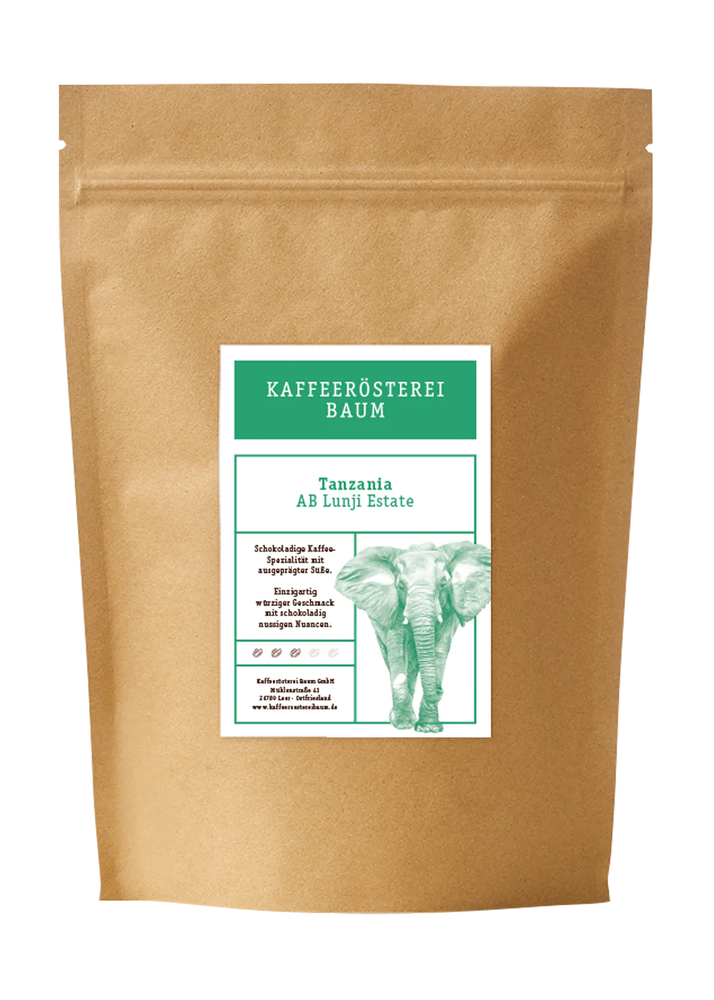
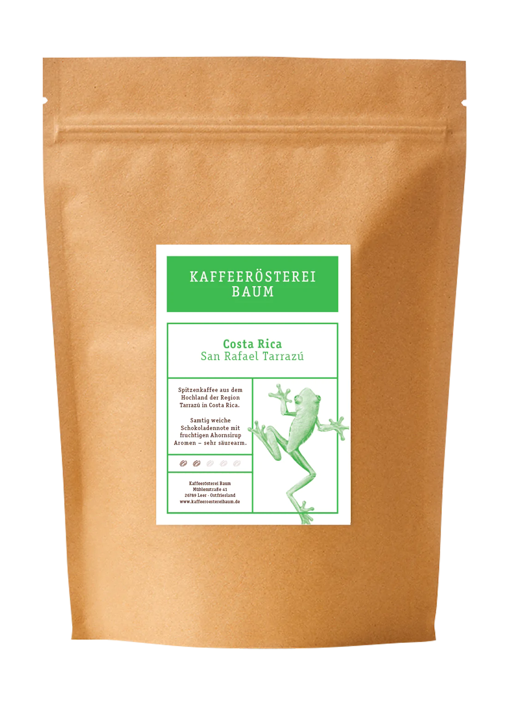
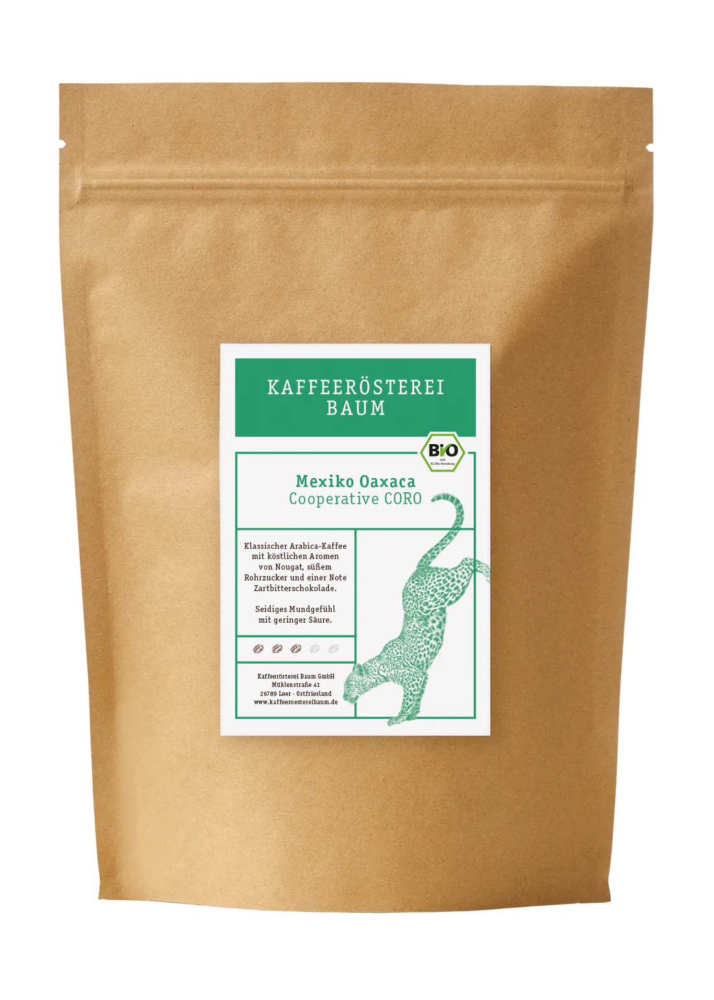
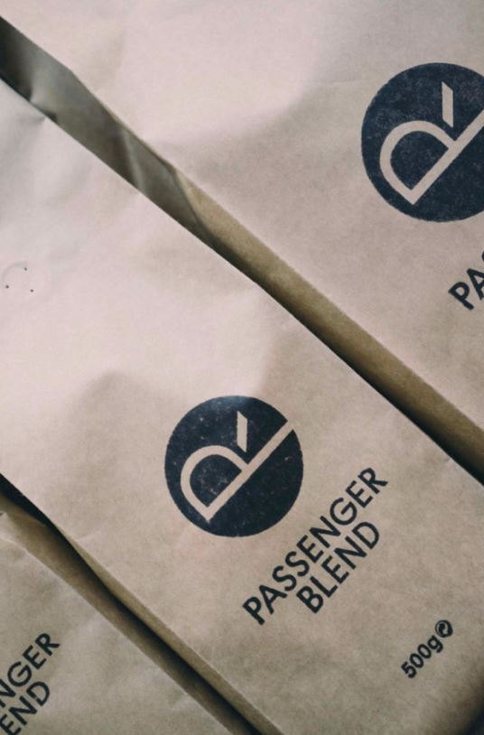

# My Coffee Grinder Settings

### G-Micron
| Coffee                                                                                                                          |                                                                    | Espresso Grinder Grind Size | Notes
|---------------------------------------------------------------------------------------------------------------------------------|--------------------------------------------------------------------|-----------------------------| ---
| [ HONDURAS MARCALA COMSA COOPERATIVE BIO ](https://shop.kaffeeroestereibaum.de/collections/kaffee/products/kaffee-honduras-bio) |               | 4.0                         | 
| [ TANZANIA AB LUNJI ESTATE ](https://shop.kaffeeroestereibaum.de/collections/kaffee/products/kaffee-tanzania)                   |       | 10.0                        | 
| [ COSTA RICA SAN RAFAEL TARRAZU ](https://shop.kaffeeroestereibaum.de/collections/kaffee/products/kaffee-costa-rica)            |  | 7.0                         |
| [ MEXICO OAXACA COOPERATIVE CORO BIO](https://shop.kaffeeroestereibaum.de/collections/kaffee/products/kaffee-mexico-bio)        |                  | 4.0                         |
| [ PASSENGER BLEND ](https://www.passenger-coffee.de/produkt/passenger-blend/)                                                   |                | 21.0                        | 

